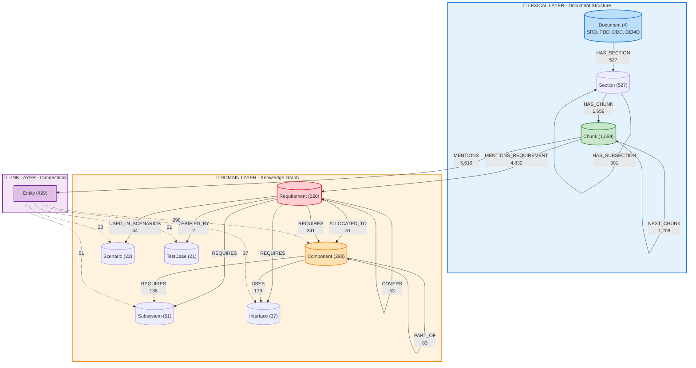
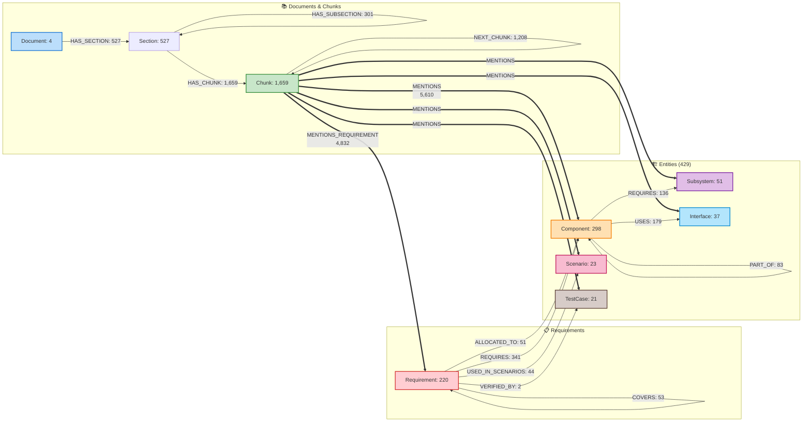
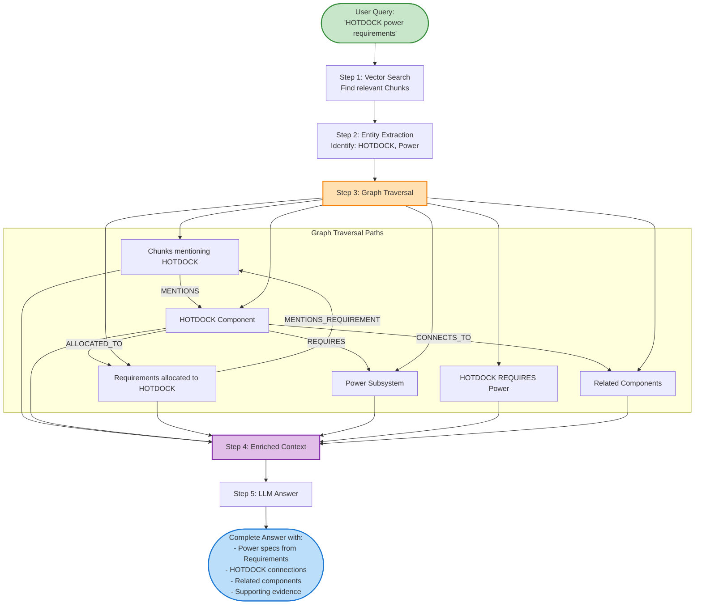
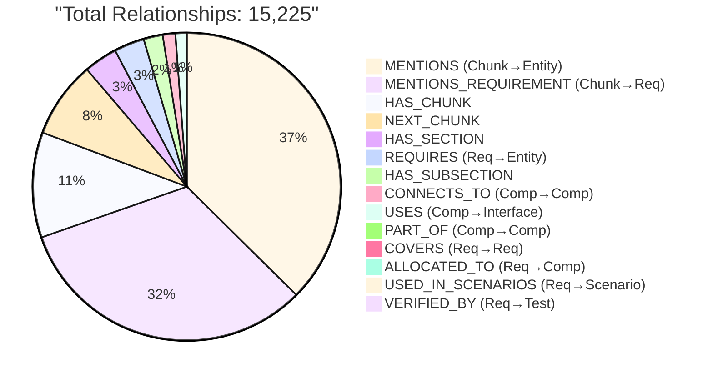
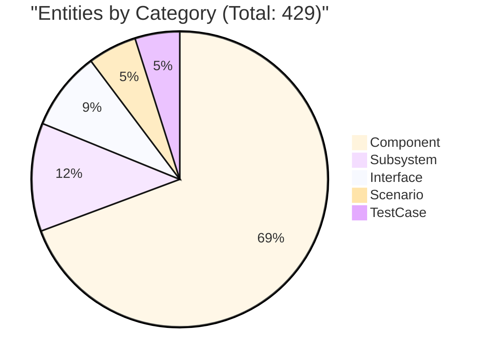
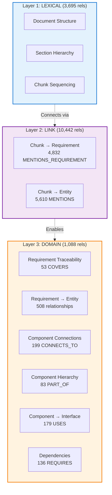

# MOSAR GraphRAG Complete Structure

## 전체 시스템 구조

## 상세 관계도

## GraphRAG Query Flow

## Relationship 분포

## Entity 분포

## 3-Layer Architecture

---

## 통계 요약

### Nodes
- **Documents**: 4
- **Sections**: ~527
- **Chunks**: 1,659
- **Requirements**: 220
- **Entities**: 429
  - Components: 298
  - Subsystems: 51
  - Interfaces: 37
  - Scenarios: 23
  - TestCases: 21

**총 Nodes**: ~2,839개

### Relationships
- **Lexical Layer**: 3,695 (문서 구조)
- **Link Layer**: 10,442 (Chunk 연결)
- **Domain Layer**: 1,088 (지식 그래프)

**총 Relationships**: **15,225개**

---

## 사용 방법

이 Mermaid 다이어그램들은 다음 도구들에서 볼 수 있습니다:

1. **GitHub**: 이 파일을 GitHub에 업로드하면 자동으로 렌더링됩니다
2. **VSCode**: Mermaid Preview 확장 설치 후 미리보기
3. **온라인**: https://mermaid.live 에서 코드 복사-붙여넣기
4. **Obsidian**: Mermaid 플러그인 활성화
